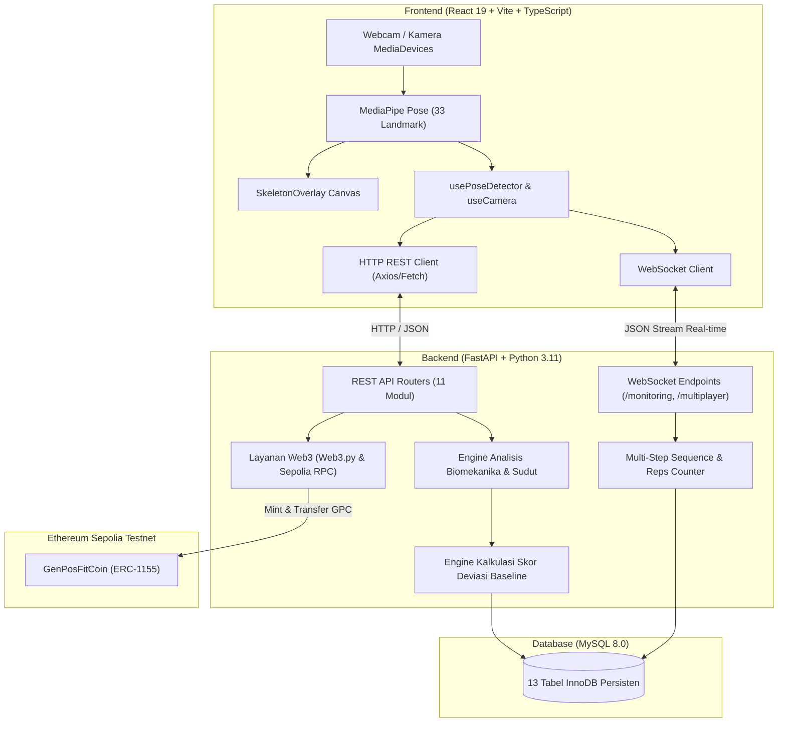

<div align="center">

# 🧘 GenPosFit — Gen Posture and Fit

**Sistem Monitoring & Terapi Postur AI Berbasis Personalisasi Baseline, Multi-Step Pose Sequencing, Battle Multiplayer, Gamifikasi, dan Reward Web3 (GPC Token)**


-363636?logo=solidity&logoColor=white)

</div>

---

## 📑 Daftar Isi

1. [Konsep Besar & Nilai Tambah](#1-konsep-besar--nilai-tambah)
2. [Arsitektur Sistem](#2-arsitektur-sistem)
3. [Tech Stack](#3-tech-stack)
4. [Fitur Utama Sistem](#4-fitur-utama-sistem)
   - [A. Onboarding & Profil Baseline Postur Personal](#a-onboarding--profil-baseline-postur-personal)
   - [B. Live Monitoring Real-Time & Evaluasi Biomekanika](#b-live-monitoring-real-time--evaluasi-biomekanika)
   - [C. Latihan Terapi & Multi-Step Pose Skeleton Sequencing](#c-latihan-terapi--multi-step-pose-skeleton-sequencing)
   - [D. Kelola Latihan Admin & Bank Variasi Gerakan (32 Templat)](#d-kelola-latihan-admin--bank-variasi-gerakan-32-templat)
   - [E. Sistem Notifikasi Toast Shadcn (Posisi Kanan Atas)](#e-sistem-notifikasi-toast-shadcn-posisi-kanan-atas)
   - [F. Navigasi Terpadu & Favicon Modern](#f-navigasi-terpadu--favicon-modern)
   - [G. Multiplayer Battle Room (1v1 & Solo Room)](#g-multiplayer-battle-room-1v1--solo-room)
   - [H. Sistem Gamifikasi: Misi & Leaderboard Musiman](#h-sistem-gamifikasi-misi--leaderboard-musiman)
   - [I. Reward Token Web3: GenPosFit Coin (GPC) di Sepolia](#i-reward-token-web3-genposfit-coin-gpc-di-sepolia)
5. [Struktur Database MySQL (13 Tabel)](#5-struktur-database-mysql-13-tabel)
6. [Backend API & WebSocket (FastAPI)](#6-backend-api--websocket-fastapi)
7. [Frontend SPA (React 19 + TypeScript)](#7-frontend-spa-react-19--typescript)
8. [Instalasi & Menjalankan (Docker Compose)](#8-instalasi--menjalankan-docker-compose)
9. [Deploy Publik via Ngrok Tunnel](#9-deploy-publik-via-ngrok-tunnel)
10. [Operasional Smart Contract GPC (Sepolia)](#10-operasional-smart-contract-gpc-sepolia)
11. [Testing & Penjaminan Mutu (QA)](#11-testing--penjaminan-mutu-qa)
12. [Struktur Repositori](#12-struktur-repositori)

---

## 1. Konsep
GenPosFit memadukan artificial intelligence, blockchain, dan computer vision untuk memantau serta melatih postur tubuh melalui profil personal yang dibangun sejak tahap Pose Enrollment. Lewat pendekatan gamifikasi interaktif, pengguna ditantang untuk menyelesaikan berbagai misi demi mengumpulkan poin dan menduduki puncak peringkat bulanan. Sebagai apresiasi, pemuncak klasemen setiap bulannya dihadiahi token blockchain dari kami yang dapat dicairkan atau dikonversi menjadi aset digital pribadi.

Sebagian besar aplikasi monitoring postur hanya menggunakan *threshold statis generik* (contoh: *"sudut leher harus selalu 165°"*). Pendekatan tersebut sering menghasilkan alarm palsu (*false alarm*) karena anatomi manusia bervariasi: tinggi badan, bentuk bahu, kelengkungan tulang belakang, serta posisi meja kerja berbeda-beda.

**GenPosFit hadir dengan pendekatan inovatif:**
1. **Profil Postur Personal (Posture Baseline Profile):** Pengguna melakukan kalibrasi pose awal (multi-orientasi: frontal, lateral kiri, lateral kanan; multi-kondisi: tegak ideal vs rileks alami). Deteksi postur buruk dihitung dari **tingkat deviasi terhadap postur normal pengguna itu sendiri**.
2. **Multi-Step Pose Skeleton Sequencing (Latihan Multi-Fase):** Gerakan latihan fisioterapi dan kalisthenik (seperti *push-up*, *squat*, atau *chin tuck*) dianalisis per fase gerakan. Repetisi dihitung **+1** hanya bila rangkaian fase dipenuhi secara berurutan sesuai pose skeleton referensi pelatih.
3. **Interaktivitas Sosial & Gamifikasi:** Sesi multiplayer battle 1v1 berbasis room code dengan verifikasi pose real-time, sistem quest harian/mingguan, serta papan peringkat musiman.
4. **Reward On-Chain Web3 (GPC Token):** Distribusi reward token ERC-1155 *GenPosFit Coin* di jaringan Ethereum Sepolia Testnet bagi pengguna berprestasi. Dilengkapi fallback **Dompet Komunitas Bersama** (`0x6EdcA860c066FCdA6c434095d5901810DCE12b48`) tanpa mewajibkan ekstensi MetaMask, dengan kalkulasi pendapatan reward yang tetap terisolasi dan akurat per akun pengguna.

---

## 2. Arsitektur Sistem



---

## 3. Tech Stack

| Layer | Teknologi | Versi / Keterangan |
|---|---|---|
| **Frontend** | React 19, Vite, TypeScript | SPA modern dengan performa tinggi & type safety penuh |
| **Styling & UI** | Tailwind CSS v4, Lucide React, Recharts | Desain adaptif dengan dukungan Dark/Light mode otomatis |
| **Komponen Notifikasi** | Shadcn UI Toast (Top-Right Viewport) | Queue dispatcher terpusat, auto-dismiss, dan 5 varian semantik |
| **Vision AI** | Google MediaPipe Pose (33 Landmarks) | Ekstraksi skeleton tubuh real-time langsung di browser client |
| **Backend** | FastAPI, Uvicorn, Python 3.11 | REST API asinkron berkinerja tinggi + WebSockets |
| **ORM & DB Driver** | SQLAlchemy 2.0, PyMySQL, Cryptography | Pemetaan relasional persisten & keamanan kredensial |
| **Database** | MySQL 8.0 (InnoDB) | 13 tabel dengan foreign key, indexing, dan integritas data |
| **Web3 & Smart Contract**| Solidity 0.8.24, OpenZeppelin v5, Hardhat, Web3.py | ERC-1155 Multi-Token di Ethereum Sepolia Testnet |
| **Infra & Container** | Docker Compose (5 Services Utama + GPC) | `db`, `backend`, `frontend`, `phpmyadmin`, `ngrok`, `gpc` |
| **Tunneling Publik** | Ngrok Official Docker (`ngrok/ngrok:latest`) | HTTPS public endpoint untuk remote testing & kamera mobile |

---

## 4. Fitur Utama Sistem

### A. Onboarding & Profil Baseline Postur Personal
- **Multi-Orientasi:** Frontal (tampak depan), Lateral Kiri (samping kiri), Lateral Kanan (samping kanan).
- **Multi-Kondisi:** Duduk Tegak (kapasitas terbaik), Duduk Rileks (kebiasaan kerja alami), Berdiri Tegak, Berdiri Rileks.
- **Ekstraksi Landmark:** Merekam 90 frame berturut-turut (~3 detik), menghitung rata-rata sudut leher (telinga-bahu-pinggul), sudut punggung (bahu-pinggul-lutut), dan kemiringan bahu serta standar deviasi sebagai toleransi personal.
- **Simulator Biomekanika:** Dukungan fallback sintetis jika pengguna tidak mengizinkan akses kamera pada sesi demo.

### B. Live Monitoring Real-Time & Evaluasi Biomekanika
- Komunikasi streaming data landmark per frame via WebSocket (`/api/monitoring/ws/{user_id}`).
- Gauges skor deviasi real-time (0–100) dengan tiga kategori:
  - **Bagus (≥ 85):** Postur ergonomis ideal.
  - **Ringan (60–84):** Deviasi ringan (dagu sedikit maju atau bahu agak miring).
  - **Buruk (< 60):** Postur buruk terdeteksi, memicu alert suara buzzer dan banner rekomendasi terapi.

### C. Latihan Terapi & Multi-Step Pose Skeleton Sequencing
- **Siklus Gerakan Multi-Step:** Gerakan latihan tidak lagi dibatasi hanya 1 pose statis. Latihan kompleks dapat dipecah menjadi beberapa fase pose berurutan.
  - *Contoh Push-Up:* **Step 1 (Posisi Atas / Plank)** $\rightarrow$ **Step 2 (Turun Dada Rendah / Siku 90°)** $\rightarrow$ **Step 3 (Dorong Naik Kembali)**.
  - Repetisi hanya dihitung **+1** setelah seluruh rangkaian step diselesaikan secara berurutan.
- **Reaksi Maskot Ekspresi Skor Real-time:** Menampilkan kartu umpan balik emosional berbasis skor akurasi latihan pengguna:
  - 😄 **Pose Sangat Baik (≥80%):** Maskot ekspresi bahagia (*Happy*).
  - 😐 **Pose Cukup Baik (60–79%):** Maskot ekspresi datar (*Flat*).
  - 🙁 **Perlu Diperbaiki (<60%):** Maskot ekspresi sedih (*Sad*).
  - 🧘 **Siap Latihan (Netral):** Maskot ekspresi siap sebelum latihan dimulai.
- **Ghost Skeleton Panduan:** Canvas menampilkan kerangka referensi ungu milik pelatih untuk step aktif yang sedang dikerjakan.
- **Perekam Pose Kamera Pelatih:** Admin/Pelatih dapat menambah atau menghapus step gerakan, lalu merekam pose target langsung dari kamera pelatih (snapshot instan maupun multi-frame averaging).
- **Simulasi Transisi Step:** Tombol *Putar Urutan Step* untuk melihat animasi simulasi transisi fase gerakan skeleton.

### D. Kelola Latihan Admin & Bank Variasi Gerakan (32 Templat)
- Modul administrasi di halaman **Kelola Latihan** (`/admin/exercises`) dan **Latihan Terapi** (`/exercises`).
- **Viewport Kamera Pelatih Luas (`h-80 sm:h-96`):** Tampilan kamera perekam pose di admin diperbesar agar pengamatan skeleton saat demonstrasi gerakan terlihat jelas.
- **Bank Variasi Gerakan:** Menyediakan 32 templat variasi biomekanika siap pakai (kategori Leher & Bahu, Punggung & Pinggang, Ekstremitas Bawah, hingga Multi-Step Reps).
- Fitur *Tambah Banyak Sekaligus (Batch Add)* untuk mengimpor kumpulan variasi gerakan ke jenis latihan yang dipilih.

### E. Sistem Notifikasi Toast Shadcn (Posisi Kanan Atas)
- Arsitektur notifikasi bergaya **Shadcn UI** dengan viewport tetap di sudut kanan atas (`fixed top-4 right-4 z-[100]`).
- Mendukung 5 varian semantik dengan styling kontras tinggi dan ikon Lucide: `default`, `success`, `destructive`, `info`, dan `warning`.
- Terintegrasi penuh ke seluruh modul: autentikasi (login/register), klaim reward poin & hubungkan dompet Web3, distribusi token GPC, aksi room multiplayer (buat room, gabung room, salin kode), serta manajemen gerakan latihan.

### F. Navigasi Terpadu & Favicon Modern
- Menggunakan menu drawer responsif (hamburger menu) untuk tampilan yang bersih dan konsisten di seluruh ukuran layar (desktop, tablet, mobile).
- Favicon aplikasi dan identitas visual diperbarui dengan logo SVG resmi `public/logo.svg`.

### G. Multiplayer Battle Room (1v1 & Solo Room)
- Sistem room 6 karakter (contoh: `GPF-9021`) berbasis WebSocket (`/api/multiplayer/ws/{room_code}`).
- **Pemilihan Mascot & Persona Room:** Pemain dapat memilih avatar maskot ceria (Green, Blue, Red, Black) dengan seleksi independen antara formulir buat room dan gabung room serta pencegahan bentrok warna/maskot antar pemain dalam 1 room.
- **Vision-Aware Skeleton Rigging:** Mengikuti pergerakan skeleton tubuh pemain secara langsung dan interaktif.
- **Lobby & Ready Check:** Host dan Guest dapat memilih latihan terapi yang akan ditandingkan, mengubah status Ready, dan Host dapat menekan tombol **Mulai Latihan**.
- **Dukungan Solo & Multiplayer:** Pemain dapat berlatih tanding berdua maupun latihan mandiri di dalam room.
- **Skoring Kompetitif:** Evaluasi sinkron skor kecocokan pose, persentase repetisi selesai, penentuan pemenang (+25 poin) dan peserta (+8 poin) yang otomatis tercatat ke riwayat battle dan misi.

### H. Sistem Gamifikasi: Misi & Leaderboard Musiman
- **Misi Harian & Mingguan:** Mengukur aktivitas nyata pengguna (menit monitoring postur, repetisi latihan terapi, kalibrasi baseline, kemenangan battle).
- **Buku Besar Poin (`point_ledger`):** Setiap klaim hadiah poin dicatat secara transparan dan idempoten.
- **Papan Peringkat Musiman (Leaderboard):** Menampilkan peringkat Top-N pengguna dengan akumulasi poin tertinggi dalam satu musim aktif.

### I. Reward Token Web3: GenPosFit Coin (GPC) di Sepolia
- Smart contract **`GenPosFitCoin`** (ERC-1155) di-deploy pada jaringan **Ethereum Sepolia Testnet**.
- **Dompet Komunitas Default (Tanpa Syarat MetaMask):** Alamat fallback default `0x6EdcA860c066FCdA6c434095d5901810DCE12b48` disiapkan untuk seluruh pengguna agar siap menerima reward tanpa dipaksa memasang ekstensi browser MetaMask.
- **Koneksi MetaMask Pribadi (Opsional):** Pengguna yang ingin menggunakan dompet pribadi tetap dapat menghubungkan MetaMask via tanda tangan kriptografis EIP-191 (`personal_sign`).
- **Isolasi Pendapatan Per-Akun:** Meskipun banyak akun menggunakan dompet bersama, nominal reward (`total_gpc_diterima`) dan riwayat perolehan dihitung spesifik per `user_id` dari riwayat transaksi yang sukses.
- **Shortcut Admin Distribusi Reward:** Panel admin menyediakan tombol pintas untuk mengeksekusi distribusi reward bulanan secara otomatis berdasarkan peran pengguna (semua user non-admin) secara instan. Transaksi tercatat di tabel `gpc_reward_tx` dan dapat diverifikasi langsung di Etherscan Sepolia.

---

## 5. Struktur Database MySQL (13 Tabel)

Database persisten `genposfit` menggunakan engine InnoDB dengan relasi foreign key dan index performa:

| No | Tabel | Deskripsi & Kolom Kunci |
|:---:|---|---|
| 1 | `users` | Akun pengguna & admin (`user_id`, `email`, `role`, `password_hash`, `wallet_address`) |
| 2 | `pose_baseline` | Profil kalibrasi postur personal (`user_id`, `orientasi`, `tipe_pose`, sudut rata-rata, standar deviasi) |
| 3 | `posture_logs` | Log time-series telemetri monitoring postur (`user_id`, `sudut_leher`, `sudut_punggung`, `skor_deviasi`, `status`) |
| 4 | `exercise_types` | Kategori induk latihan terapi (`type_id`, `nama`, `deskripsi`) |
| 5 | `exercises` | Daftar gerakan terapi (`exercise_id`, `nama`, `sudut_target` bertipe JSON dengan `pose_steps`, `skeleton_data`, `is_battle`) |
| 6 | `exercise_sessions` | Riwayat sesi latihan selesai (`session_id`, `user_id`, `exercise_id`, `total_reps`, `avg_skor`) |
| 7 | `rooms` | Room sesi latihan multiplayer / solo (`room_id`, `room_code`, `status`, `exercise_id`, `host_id`) |
| 8 | `room_players` | Daftar pemain dalam room multiplayer (`room_id`, `user_id`, `is_ready`, `skor_akhir`) |
| 9 | `point_ledger` | Buku besar transaksi poin gamifikasi (`ledger_id`, `user_id`, `jumlah_poin`, `sumber`, `referensi_id`) |
| 10 | `quests` | Master data misi harian & mingguan (`quest_id`, `judul`, `tipe_target`, `target_value`, `reward_poin`) |
| 11 | `user_quests` | Progres misi per pengguna (`user_quest_id`, `user_id`, `quest_id`, `current_value`, `is_claimed`) |
| 12 | `battle_results` | Rekapitulasi hasil tanding multiplayer (`battle_id`, `room_code`, `winner_id`, `loser_id`, `skor_winner`, `skor_loser`) |
| 13 | `gpc_reward_tx` | Catatan transaksi minting reward token GPC on-chain (`tx_id`, `periode`, `user_id`, `wallet_address`, `tx_hash`, `status`) |

---

## 6. Backend API & WebSocket (FastAPI)

Dokumentasi OpenAPI (Swagger) interaktif dapat diakses di `http://localhost:8042/docs`.

### Modul Router Utama

| Prefix Path | Router | Fungsi Utama |
|---|---|---|
| `/api/auth` | `auth.py` | Registrasi, login JWT, validasi token pengguna dan admin |
| `/api/users` | `users.py` | Profil pengguna, riwayat postur, pembaruan data fisik |
| `/api/registration` | `registration.py` | Perekaman dan penyimpanan baseline pose personal |
| `/api/monitoring` | `monitoring.py` | Evaluasi postur HTTP REST & WebSocket streaming real-time |
| `/api/exercises` | `exercises.py` | Katalog latihan terapi, batch preset, dan pencatatan sesi |
| `/api/multiplayer` | `multiplayer.py` | Manajemen room, lobby ready check, dan WebSocket sinkronisasi battle |
| `/api/quests` | `quests.py` | Daftar misi aktif pengguna dan klaim reward poin |
| `/api/leaderboard` | `leaderboard.py` | Papan peringkat musiman publik |
| `/api/wallet` | `wallet.py` | Status wallet per-akun, bind dompet komunitas fallback (tanpa MetaMask), challenge nonce & verifikasi signature EIP-191 |
| `/api/admin` | `admin.py` | CRUD jenis/gerakan latihan, katalog variasi, manajemen misi, dan distribusi reward GPC |

---

## 7. Frontend SPA (React 19 + TypeScript)

Antarmuka dibangun dengan React 19, TypeScript, dan Tailwind CSS dengan 11 halaman utama:

| Halaman | File Sumber | Deskripsi & Fitur |
|---|---|---|
| **Overview** | `LandingPage.tsx` | Beranda informatif, demo simulator biomekanika interaktif, 6 pilar inovasi, dan banner CTA |
| **Navigasi Terpadu**| `Navbar.tsx` | Header sticky, status AI online, indikator halaman aktif, dan drawer menu grid responsif |
| **Live Monitor** | `Monitor.jsx` | Monitoring postur real-time dengan video kamera, gauge skor, telemetri, dan audio alert |
| **Kalibrasi Pose** | `RegisterPose.jsx` | Wizard kalibrasi onboarding baseline multi-orientasi dan multi-kondisi |
| **Dashboard** | `Dashboard.jsx` | Grafik analitik kepatuhan ergonomis, riwayat latihan, status dompet bersama, dan KPI statistik |
| **Latihan Terapi** | `Exercises.tsx` | Runner latihan terapi multi-step, ghost skeleton pelatih, reaksi ekspresi maskot skor, dan toast |
| **Kelola Latihan** | `AdminExercises.tsx` | Modul admin CRUD gerakan, Multi-Step Skeleton Manager, Bank 32 Variasi, dan kamera pelatih luas |
| **Multiplayer Room** | `Multiplayer.tsx` | Lobby room, ready check, pemilihan avatar maskot unik, tombol Mulai Latihan, dan layar battle sinkron 1v1 / solo |
| **Misi & Peringkat** | `MisiPeringkat.tsx` | Papan misi harian/mingguan, klaim poin, leaderboard musiman, dompet komunitas bersama, dan reward token GPC |
| **Admin Panel** | `AdminPage.tsx` | Dashboard distribusi reward token GPC on-chain dan audit ledger |
| **Autentikasi** | `AuthPage.tsx` | Form login dan registrasi akun (dukungan role Admin & User) dengan toast feedback |
| **Skeleton Inspector**| `SkeletonPreview.tsx` | Visualisasi 3D dan analisis titik landmark skeleton MediaPipe |

---

## 8. Instalasi & Menjalankan (Docker Compose)

### Prasyarat
- **Docker Engine** (v24+) & **Docker Compose** (v2+).
- **Make** (opsional namun sangat disarankan untuk menjalankan shortcut otomatis).

### Langkah Menjalankan

```bash
# 1. Clone repositori & salin file konfigurasi environment
cp .env.example .env

# 2. Jalankan seluruh container stack utama (background / detached)
make up-detached

# 3. Jalankan inisialisasi skema & database seeder
make seed

# 4. Periksa status seluruh container
make ps
```

### Port & Akses Layanan

| Layanan | URL Lokal | Keterangan |
|---|---|---|
| **Frontend Web** | `http://localhost:3042` | Aplikasi utama GenPosFit |
| **Backend Swagger** | `http://localhost:8042/docs` | Dokumentasi API interaktif |
| **PhpMyAdmin** | `http://localhost:8122` | GUI Database MySQL |
| **MySQL Direct** | `localhost:3348` | Port host MySQL container |
| **Ngrok Web UI** | `http://localhost:4040` | Web inspector tunnel publik |

---

## 9. Deploy Publik via Ngrok Tunnel

GenPosFit menyertakan service Ngrok resmi (`genposfit-ngrok`) di dalam `docker-compose.yml` untuk memfasilitasi pengujian mobile dan akses publik:

```bash
# Nyalakan container tunnel ngrok
make public

# Tampilkan URL publik HTTPS yang sedang aktif
make ngrok-url

# Pantau log traffic ngrok
make logs-ngrok

# Hentikan tunnel ngrok
make ngrok-down
```

> [!TIP]
> Mengakses aplikasi via domain HTTPS resmi Ngrok memastikan API kamera (`navigator.mediaDevices.getUserMedia`) langsung aktif di perangkat smartphone tanpa perlu menginstal sertifikat SSL buatan manual.

---

## 10. Operasional Smart Contract GPC (Sepolia)

Smart contract **GenPosFitCoin (GPC)** (ERC-1155) dikelola melalui Hardhat dalam container terisolasi:

```bash
# 1. Kompilasi smart contract
make gpc-compile

# 2. Jalankan unit test smart contract (Hardhat Network)
make gpc-test

# 3. Deploy kontrak ke Ethereum Sepolia Testnet
make gpc-publish

# 4. Periksa informasi kontrak on-chain (Nama, Symbol, Owner, Total Supply)
make gpc-info

# 5. Cek saldo akun deployer / treasury
make gpc-balance

# 6. Kirim token GPC ke alamat tertentu
make gpc-send TARGET=0xRecipientAddress AMOUNT=100
```

### Informasi Kontrak Sepolia Aktif
- **Nama Token:** GenPosFit Coin
- **Simbol:** GPC
- **Standar:** ERC-1155 (Fungible Token ID: `0`)
- **Maksimal Suplai:** 1.000.000.000 GPC (1 Milyar GPC)
- **Chain ID:** `11155111` (Sepolia Testnet)
- **Alamat Kontrak Aktif:** `0x1118fb265a74A4d27C5d3ca1B17a77E750a03222` (Tercatat di `gpc-contract/deployment.json`)

---

## 11. Testing & Penjaminan Mutu (QA)

Sistem telah diuji secara komprehensif pada setiap lapisan:

### A. Pengujian Backend (FastAPI & Database)
Dijalankan menggunakan framework `pytest`:
```bash
docker compose exec backend pytest tests/ -v
```
**Hasil:** **100 unit test PASSED (100%)** meliputi:
- `test_admin.py` (Manajemen jenis & gerakan latihan, distribusi reward)
- `test_auth_users.py` (Autentikasi JWT, proteksi role admin)
- `test_battles.py` & `test_multiplayer.py` (Logika room, sinkronisasi WebSocket)
- `test_exercises_registration.py` (Baseline postur, multi-step sequence)
- `test_leaderboard.py` & `test_quests.py` (Kalkulasi poin, musim, klaim reward)
- `test_monitoring.py` & `test_pose_analysis.py` (Analisis biomekanika sudut)
- `test_rewards.py` (Kalkulasi reward musiman & eksekusi transaksi Web3 GPC)
- `test_wallet.py` (Dompet default komunitas, isolasi pendapatan per-akun, verifikasi signature MetaMask)

### B. Pengujian Frontend Linter & Build (ESLint, TypeScript & Vite)
```bash
cd frontend && npm run lint && npm run build
```
**Hasil:**
- Linter ESLint bersih tanpa error (**0 error**).
- Kompilasi type-checking (`tsc -b`) dan bundler Vite berhasil tanpa error (**0 error**).

### C. Pengujian Smart Contract (Hardhat)
```bash
make gpc-test
```
**Hasil:** **8 unit test PASSED (100%)** mencakup validasi nama/simbol, kepemilikan, izin minting, transfer, burning, dan pembatasan maksimal suplai.

---

## 12. Struktur Repositori

```
genposfit/
├── .env.example                  # Templat konfigurasi environment
├── docker-compose.yml            # Konfigurasi container stack utama
├── Makefile                      # Pusat perintah otomasi Docker, DB, dan Web3
│
├── backend/                      # Service FastAPI (Python 3.11)
│   ├── Dockerfile
│   ├── requirements.txt
│   ├── app/
│   │   ├── main.py               # Inisialisasi FastAPI & Middleware
│   │   ├── config.py             # Pengaturan env & fallback konfigurasi
│   │   ├── database.py           # Koneksi SQLAlchemy & MySQL session
│   │   ├── models.py             # 13 Model ORM database persisten
│   │   ├── routers/              # 11 Modul REST API & WebSocket endpoints
│   │   ├── services/             # Engine biomekanika, skoring, & Web3 service
│   │   └── abis/                 # ABI Smart Contract GPC
│   └── tests/                    # 11 File suite pengujian unit (pytest)
│
├── frontend/                     # SPA React 19 + TypeScript + Vite
│   ├── Dockerfile
│   ├── vite.config.ts
│   ├── package.json
│   └── src/
│       ├── App.tsx               # Routing navigasi & modal autentikasi
│       ├── assets/               # Aset koin SVG & avatar maskot interaktif (webp)
│       ├── components/           # UI components, Navbar, SkeletonOverlay
│       ├── context/              # AuthContext & State global
│       ├── hooks/                # useCamera, usePoseDetector
│       ├── lib/                  # Helper API, wallet, formatting, & utilities
│       └── pages/                # 11 Halaman aplikasi (Monitor, Exercises, Multiplayer, dll.)
│
├── database/                     # Skrip inisialisasi & migrasi MySQL
│   ├── init/01_schema.sql        # Skema DDL lengkap 13 tabel
│   └── seed/                     # Skrip seeder data awal latihan & akun
│
└── gpc-contract/                 # Smart Contract ERC-1155 (Hardhat)
    ├── Dockerfile
    ├── docker-compose.yml        # Compose terisolasi untuk Hardhat
    ├── hardhat.config.js         # Konfigurasi jaringan Sepolia & compiler
    ├── contracts/GPC.sol         # Source code Solidity smart contract
    ├── scripts/                  # deploy.js, info.js, balance.js, send.js
    ├── test/GPC.test.js          # Unit test smart contract
    └── deployment.json           # Alamat & metadata kontrak Sepolia ter-deploy
```

---

<div align="center">

**GenPosFit** — *Pionir Kesehatan Postur Berbasis AI, Biomekanika Personal, dan Web3.* 🧘✨

</div>
